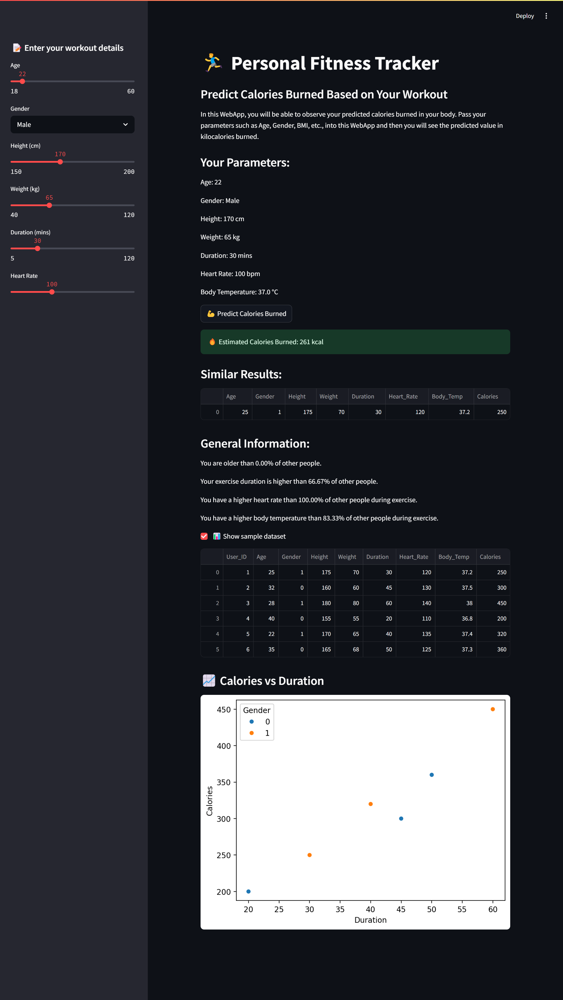

# 🏃‍♂️ Personal Fitness Tracker using Python

This is a **Personal Fitness Tracker WebApp** built using Python and Streamlit. It predicts the number of calories burned during exercise based on user input like Age, Gender, Duration, Heart Rate, etc.

## 💡 Features

- Predict calories burned based on physical parameters.
- Compare your data with other users in the dataset.
- See how your workout stats rank among others.
- Display similar records from dataset.
- Data visualizations using Seaborn and Matplotlib.

## 📊 Input Parameters

- Age
- Gender
- Height (in cm)
- Weight (in kg)
- Duration of workout (in mins)
- Heart Rate during exercise
- Body Temperature during exercise

## 🚀 How to Run the App

### 1. Clone the Repository or Download the Files

## 📂 Files

- `fitness_tracker.py` – Main Streamlit app
- `calories.csv` – Contains calories burned by each user
- `exercise.csv` – Contains exercise data (heart rate, duration, etc.)
- `README.md` – Project description and usage
- `requirements.txt` – Required Python libraries

## 🔍 Output Preview

## 🤝 Acknowledgements

Made during internship with **TechSaksham (Edunet Foundation)**.  
Inspired by YouTube tutorial by **Code With Denny**.

---
